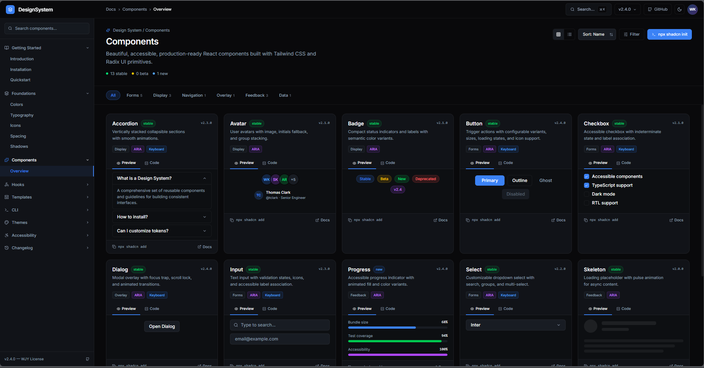

# 🌟 Wijaya Kusuma - Component Library

  <p><strong>Beautiful, accessible, and production-ready React components built with Tailwind CSS and Radix UI primitives.</strong></p>

  [](https://react.dev/)
  [](https://tailwindcss.com/)
  [](#)
  [](https://vitejs.dev/)
</div>

---


## 🎨 Overview

**Wijaya Kusuma Component Library** is a premium, custom UI collection designed for high-performance React applications. Every component is engineered with meticulous attention to detail, featuring beautiful micro-animations, full keyboard navigation support, and complete WAI-ARIA accessibility compliance out of the box.

---

## 🚀 Key Features

*   **⚡ Premium Aesthetics**: Tailored HSL color palettes, elegant dark mode compatibility, smooth transitions, and sleek modern typography.
*   **♿ WAI-ARIA Compliant**: Built on top of Radix UI primitives to ensure top-tier accessibility (ARIA tags, focus management, screen-reader support).
*   **🛠️ Developer-First Experience**: Quick copy-paste code snippets, detailed interactive documentation, and simple integration.
*   **📦 Extremely Modular**: Designed for absolute flexibility, allowing easy styling overrides with Tailwind CSS.

---

## 📂 Component Categories

The library houses **13+ stable components** categorized for ease of navigation:

### 📝 Forms & Inputs
*   **Button**: Customizable states (Primary, Outline, Ghost, Disabled) with loading transitions.
*   **Input**: Text fields equipped with validation states, icons, and accessible labeling.
*   **Select**: Flexible dropdown selection supporting searching, groups, and multi-select.
*   **Checkbox**: Fully accessible checkbox supporting indeterminate states.

### 📺 Display & Feedback
*   **Accordion**: Smooth vertical collapsible sections with custom spring transitions.
*   **Avatar**: Customizable avatars with image support, initials fallback, and group stacking.
*   **Badge**: Compact labels for status indicators (Stable, Beta, New, Deprecated).
*   **Progress**: Animated, modern progress bars showcasing loading states and color variants.
*   **Skeleton**: Smooth pulsing placeholders for asynchronous content loading.

### 🔲 Overlay & Navigation
*   **Dialog**: Modal overlay featuring focus trapping, scroll locking, and premium entrance animations.

---

## 🛠️ Getting Started

### 1. Installation

Clone this repository and install the project dependencies:

```bash
# Clone the repository
git clone <repository-url>

# Navigate into the project folder
cd "4.component library"

# Install dependencies
npm install
```

### 2. Run Local Development Server

Run the Vite development server to view the interactive documentation and component playground:

```bash
npm run dev
```

The documentation interface will be available at [http://localhost:5173](http://localhost:5173).

### 3. Production Build

Compile the project for production deployment:

```bash
npm run build
```

---

## 💻 CLI Usage

This library supports integration using standard CLI commands:

```bash
# Initialize shadcn in your project
npx shadcn init

# Add a component to your project
npx shadcn add [component-name]
```

---

## 📄 License

Distributed under the **WJY License**. See the licensing documentation for more details.

---

<div align="center">

Made with ❤️ by **Wijaya Kusuma**

</div>
